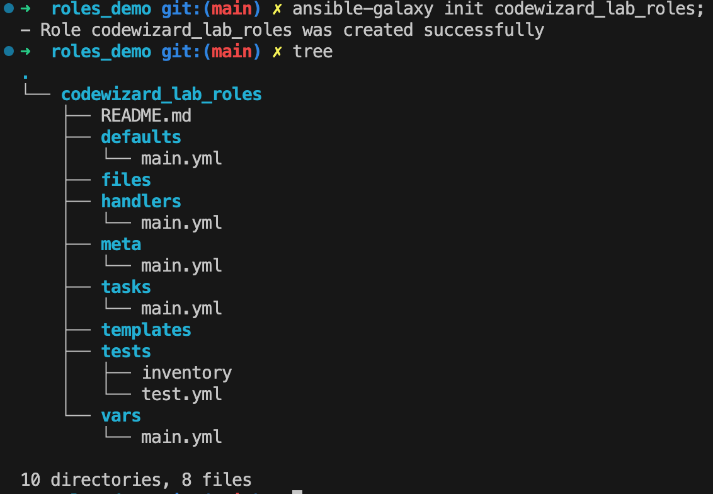

<!-- header start -->

<a href="https://stackoverflow.com/users/1755598/codewizard"></a>&emsp;&emsp;[](https://www.linkedin.com/in/nirgeier/)&emsp;[](mailto:nirgeier@gmail.com)&emsp;[](mailto:nirg@codewizard.co.il)

<!-- header end -->
# Roles

### What are Ansible roles?

- Roles let you **automatically load** related vars, files, tasks, handlers, and other Ansible artifacts based on a **known file structure**. 
- After you group your content into roles, you can easily reuse them and share them with other users.
- By default, Ansible will look in **each directory** within a role for file names `main`/`main.yml`/`main.yaml`.

### Ansible roles file structure

Files           | Description
---|---
**tasks** | the main list of tasks that the role executes.
**handlers** | handlers, which may be used within or outside this role.
**library** | modules, which may be used within this role (see Embedding modules and plugins in roles for more information).
**defaults** | default variables for the role (see Using Variables for more information). These variables have the lowest priority of any variables available and can be easily overridden by any other variable, including inventory variables.
**vars** | other variables for the role (see Using Variables for more information).
**files** | files that the role deploys.
**templates** | templates that the role deploys.
**meta** |metadata for the role, including role dependencies and optional Galaxy metadata such as platforms supported.

### Building Ansible role

- In this demo we will create a role for deploying a nodeJs app
- The app will be deployed from a pre-defined code.

#### 01. Initialize file structure

```sh
# Lets create the roles file structure
ansible-galaxy init codewizard_lab_role

# The file system of the role will look like
```



#### 03. Create the main task