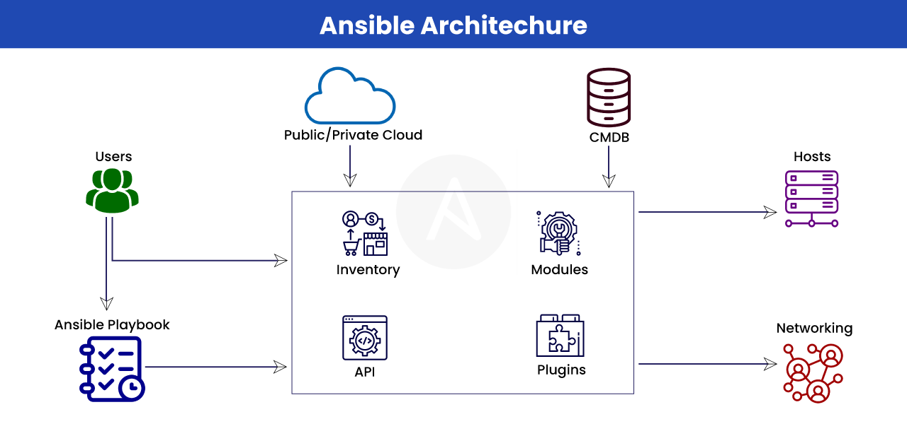

<!-- header start -->

&emsp;&emsp;&emsp;&emsp;

<!-- header end -->

---
- [Preface](#preface)
  - [What is Ansible?](#what-is-ansible)
- [How Ansible Works](#how-ansible-works)

### Preface

#### What is Ansible?

- Ansible is `Configuration Management` tool which manage the `state` of our servers, install the required packages and tools.
- Other optional use cases can be  `deployments`, `Provisioning new servers`
- The most powerful feature of Ansible is the ability to manage huge scale of servers regardless of their infrastructure (on prem, cloud, vm etc)
  
### How Ansible Works

- Ansible is an agentless tool.
- Ansible uses ssh for pulling modules and for managing the nodes
- Ansible is based upon YAML 

- An Ansible playbook is a file that contains a set of instructions that Ansible can use to automate tasks on remote hosts1. Playbooks are written in YAML, a human-readable markup language1. A playbook typically consists of one or more ‘plays’, a collection of tasks run in sequence1.

Here’s a brief overview of how `Ansible playbooks` work:

 * **Playbook Structure**: A playbook is composed of one or more ‘plays’ in an ordered list. Each play executes part of the overall goal of the playbook, running one or more tasks. Each task calls an Ansible module.
  
 * **Playbook Execution**: A playbook runs in order from top to bottom. Within each play, tasks also run in order from top to bottom. Playbooks with multiple ‘plays’ can orchestrate multi-machine deployments.
  
 * **Task Execution**: Tasks are executed by modules, each of which performs a specific task in a playbook. 
   * There are thousands of Ansible modules that perform all kinds of IT tasks.
  
 * **Reusability**: Playbooks offer a repeatable, reusable, simple configuration management and multi-machine deployment system. 
   * If you need to execute a task with Ansible more than once, write a playbook and put it under source control.
  
* Playbooks are **one of the core features of Ansible** and tell Ansible what to execute. 
  * They are used in complex scenarios. 
  * They serve as frameworks of pre-written code that developers can use ad-hoc or as a starting template. 
  * They can be saved, shared, or reused indefinitely, making it easier for IT teams to codify operational knowledge and ensure that the same actions are performed consistently.
  